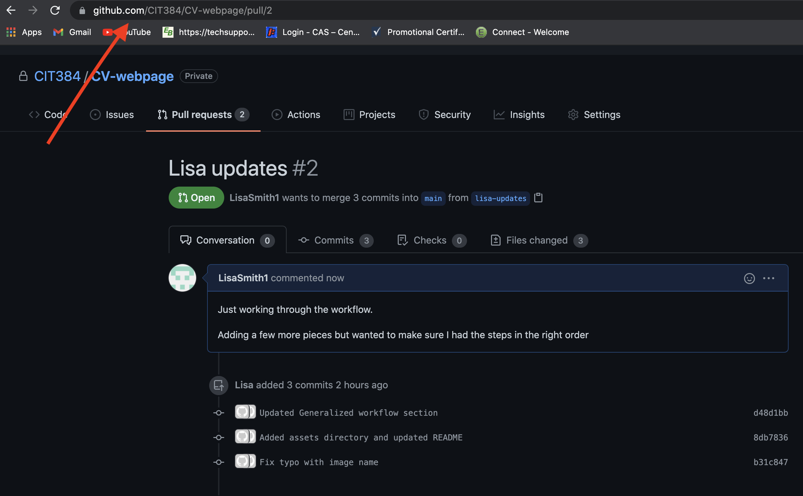
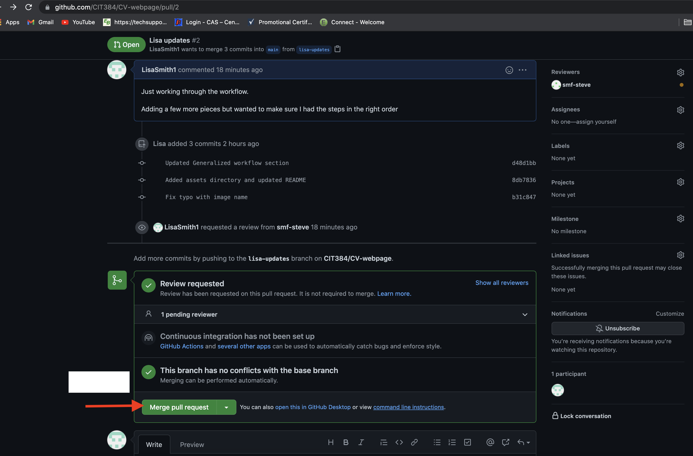

# A simple webpage highlighting the student's education, previous experiences and qualifications for a future job.

# Purpose
<<<<<<< HEAD
This project asks you to develop a simple CV (curriculum vita) using HTML. This CV will be used specifically in this class for the Professor and your teammates to learn more about you. If you already have a CV (aka resume), great -- you can pull information from there.  If not, then this is a great starting point to develop a CV before graduation.

While developing this web page is a rather simple assignment, the underlying purpose is to have you exercise various _git_ operations.  Moreover, you will need to exercise a simple workflow during the developement process.  This process does require you to have teammates.  

# Objectives
   1. To develop a simple web-page using rudimentry [HTML][HTML] to kickstart the class
   2. To prepare a simple Professional CV (curriculum vita) in preparation for a professional job after graduation 
   3. To provide useful information to the Professor and your teammates about you.
=======
This project asks you to develop a simple CV (curriculum vita) using HTML. This CV will be used specifically in this class to all the Professor and your teammates to learn more about you. If you already have a CV (aka resume), great -- you can pull information from there.  If not, then this is a great starting point to develop a CV before graduation.

While developing this web page is a rather simple assignment, the underlying purpose is to have you exercis various _git_ operations.  Moreover, you will need to exercise a simple workflow during the developement process.  This process does require you to have a teammate.  

# Objectives
   1. To develop a simple web-page using rudimentry HTML to kickstart the class
   2. To prepare a simple Professional CV (curriculum vita) in preparation for a professional job after graduation 
   3. To provide useful information to the Professor and your teammates about your you.
>>>>>>> 854e745e2a31af449f437e7427809b9e6cb0ac5a
   4. To utilize various git operations within a generalized workflow

# Generalized workflow:
  1. *Setup Phase:* Clone the appropriate git repository
<<<<<<< HEAD
      - Accept the assignment via Github Classroom
      - Run the git clone command with the URL provided when acepting the Github Classroom assignment:
        - `$ git clone https://github.com/CIT384/<LAB_NUMBER>-<GITHUB_USERNAME>`
      - Add/Invite your teammates to your repository as [collaborators][collaborators]

  2. *Developement Phase:* Incrementally improve your index.html page by successively completing the following steps.
     - Create and checkout the development (dev) branch
       - `$ git checkout -b dev`
         - The git checkout command is used to switch between branches in a repository. 
         - The `-b` flag causes a new branch to be created 
         - For more info on git checkout run `$ git checkout --help`
     - LOOP: update, test, and commit your changes -- take a break!
       - Add your file
         - `$ git add FILE_NAME`
       - Commit your change
         - `$ git commit -m "Some message"`
     - push your work into your github repo
       - `$ git push`
     - take a break

  3. *Review Phase:* Make a pull request
     - Open a [Pull Request][pull-request] on Github. 
     - Once you have created your pull request, send an email to your teammates with a CC to the Professor. Be sure to include the Github Pull Request URL in your email
      
=======

  2. *Developement Phase:* Incrementally improve your index.html page by successively completing the following steps.
     - checkout the development (dev) branch
     - LOOP: update, test, and commit your changes -- take a break!
     - push your work into your github repo
     - take a break

  3. *Review Phase:* Make a pull request
     - send a request, via email, to a classmate with a CC to the Professor
>>>>>>> 854e745e2a31af449f437e7427809b9e6cb0ac5a
     - await feedback, either:
         * you will move back to Develompent Phase to make improvements
         * you will move forward to the Deployment Phase
 
  4. *Deployment Phase:*
<<<<<<< HEAD
     - Log into your deployment host  -- although this is bad, this we will do for know
     - Clone the repo
       - Reference step 1 for `git clone` command 
     - Checkout the production (main) branch
       - If you are not sure what branch you are currently on you can use the following commands to verify that you are on the `main` branch:
         - `$ git status`
         - `$ git branch` -- The branch listed with an `*` is the current branch
=======
     - Log into your deployment host  -- although this is bad, this will do for know
     - Clone the repo
     - Checkout the production (main) branch
>>>>>>> 854e745e2a31af449f437e7427809b9e6cb0ac5a
     - Send an email to the team indicating that the Version X has been deployed.

## Review Phase from the teammates perspective

  1. *Review Phase:* Receive a pull request
     - receive email
     - review the updates on the development (dev) branch
<<<<<<< HEAD
        -  git pull, git checkout, review
=======
        -  git pull, git checkout, refiw
>>>>>>> 854e745e2a31af449f437e7427809b9e6cb0ac5a
     - Either Accept or Reject
  2. Reject
     - update the develompment (dev) branch with various corrections
     - send email to the team identifying the problems, etc.
<<<<<<< HEAD
  3. Approve
     - merge the changes onto the production (main) branch
     
     - assign a [version tag][version-tags] to the software
=======
  3. Accept
     - merge the changes onto the production (main) branch
     - assign a version tag to the software
>>>>>>> 854e745e2a31af449f437e7427809b9e6cb0ac5a
     - push the software to the repo
     - inform the team (via email) that Version X has been created.

# Requirements:
  1. Identify two people in the class to be your teammates: 
<<<<<<< HEAD
  2. Updates to the CV must be performed with at least three independent push operations, which **CANNOT** occur on the same day!
=======
  2. Updates to the CV must be performed with at least three independent push operations, which CANNOT occur on the same day!
>>>>>>> 854e745e2a31af449f437e7427809b9e6cb0ac5a
  3. A teammate must review you work via the Review Phase, you may NOT review this teammates work.
  4. Your teammate is responsible for:
      - providing constructive feedback
      - correcting spelling and grammar mistakes, etc.
 

# Directions:
You are to develop a simple web-site that contains a single web page.  this page will be the start of your Professional CV.

# Required Sections
You are to include the following information within the CV
1. Major Projects
2. Career Objectives
3. Employment History
4. Education Summary
   * Major/Minor
   * Major GPA, Overal GPA
   * Favorite Class/es
<<<<<<< HEAD
   * Least Favortie Class/es
=======
   * Leas Favortie Class/es
>>>>>>> 854e745e2a31af449f437e7427809b9e6cb0ac5a
7. Professional Interest
8. Professional Development Activities
   * Meetup
   * hackathons
<<<<<<< HEAD
   * Seminars
   * Student Groups
9. Assignment Teammates:
   - name, email, and github URL for this assignment

[pull-request]: https://docs.github.com/en/github/collaborating-with-pull-requests/proposing-changes-to-your-work-with-pull-requests/creating-a-pull-request

[collaborators]: https://docs.github.com/en/account-and-profile/setting-up-and-managing-your-github-user-account/managing-access-to-your-personal-repositories/inviting-collaborators-to-a-personal-repository

[HTML]: https://developer.mozilla.org/en-US/docs/Learn/Getting_started_with_the_web/HTML_basics

[version-tags]: https://www.atlassian.com/git/tutorials/inspecting-a-repository/git-tag
=======
   * Seminors
   * Student Groups
9. Assignment Teammates:
   - name, email, and github URL for this assignment
>>>>>>> 854e745e2a31af449f437e7427809b9e6cb0ac5a
